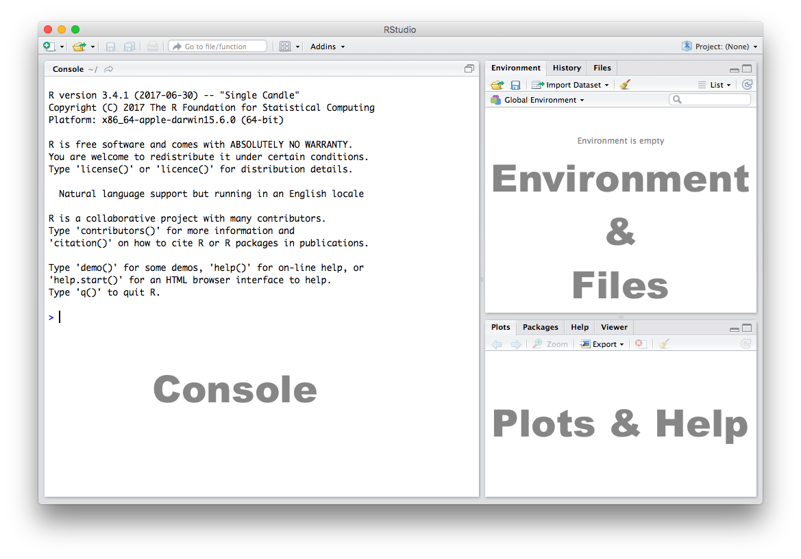
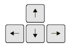
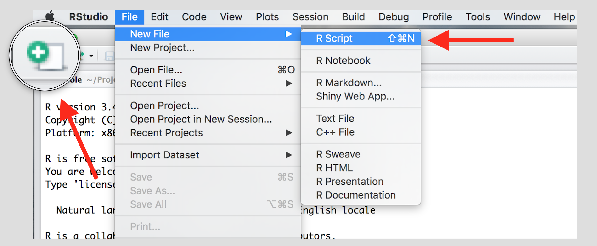
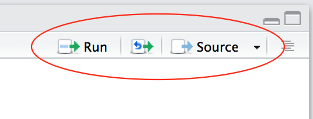

```{r include=FALSE, cache=FALSE}
rm(list=ls(all=TRUE))

# setup common knitr  options
knitr::opts_knit$set(
  root.dir = "docs"
)

knitr::opts_chunk$set(
  comment = ""
)

chapter_header <- function(week) {
  if (knitr::opts_knit$get("rmarkdown.pandoc.to") == "html")
    cat(sprintf(readLines("../../include/header_toolbar.html"),
                as.integer(week)))
}
```

# About this course {-}

This course is an introduction R, RStudio and statistics. Our primary aims are to get comfortable working with R and to be able to prepare, manipulate, analyse and visualise data..

----

<div class="container btn-container">
  <button type = "button" class = "btn btn-lg btn-primary" onclick="window.open('https://github.com/philippbroniecki/suffolk2019/raw/master/admin/agenda.pdf');">Agenda</button>
</div>

<!--chapter:end:index.Rmd-->

```{r include=FALSE, cache=FALSE}
rm(list=ls(all=TRUE))

# setup common knitr  options
knitr::opts_knit$set(
  root.dir = "docs"
)

knitr::opts_chunk$set(
  comment = ""
)

chapter_header <- function(week) {
  if (knitr::opts_knit$get("rmarkdown.pandoc.to") == "html")
    cat(sprintf(readLines("../../include/header_toolbar.html"),
                as.integer(week)))
}
```
# Introduction to R and RStudio

```{r package_options, include=FALSE}
knitr::opts_knit$set(global.par = TRUE)
```

```{r, include = FALSE}
par(bg = '#fdf6e3')
```

## Learning objectives

In this session, we will have a look at R and RStudio. We will interact with both and use the various components of RStudio.

### What is R?

R is an environment for statistical computing and graphics. RStudio is an editor or integrated development environment (IDE) that makes working with R much more comfortable.

To install R and RStudio on your computer, download both from the following sources:

- Download R from [The Comprehensive R Archive Network (CRAN)](https://cran.r-project.org) 
- Download RStudio from [RStudio.com](https://www.rstudio.com)

Keep both R and RStudio up to date. That means go online and check for newer versions. In case there are new versions, download those and re-install.

### RStudio

Let's get acquainted with R. When you start RStudio for the first time, you'll see three panes:



### Console

The Console in RStudio is the simplest way to interact with R. You can type some code at the Console and when you press ENTER, R will run that code. Depending on what you type, you may see some output in the Console or if you make a mistake, you may get a warning or an error message.

Let's familiarize ourselves with the console by using R as a simple calculator:

```{r}
2 + 4
```

Now that we know how to use the `+` sign for addition, let's try some other mathematical operations such as subtraction (`-`), multiplication (`*`), and division (`/`).

```{r}
10 - 4
5 * 3
7 / 2
```

| | |
|-----------------------------------------------------------------|-----------------------|
|You can use the cursor or arrow keys on your keyboard to edit your code at the console:<br>- Use the UP and DOWN keys to re-run something without typing it again<br>- Use the LEFT and RIGHT keys to edit||

Take a few minutes to play around at the console and try different things out. Don't worry if you make a mistake, you can't break anything easily!

### Scripts

The Console is great for simple tasks but if you're working on a project you would mostly likely want to save your work in some sort of a document or a file. Scripts in R are just plain text files that contain R code. You can edit a script just like you would edit a file in any word processing or note-taking application.

Create a new script using the menu or the toolbar button as shown below.



Once you've created a script, it is generally a good idea to give it a meaningful name and save it immediately. For our first session save your script as **seminar1.R**

| | |
|----------------------------------------------------|------------------------------------------|
|Familiarize yourself with the script window in RStudio, and especially the two buttons labeled **Run** and **Source**||

There are a few different ways to run your code from a script.

| | |
|------------------|-------------------------------------------------------|
|One line at a time|Place the cursor on the line you want to run and hit CTRL-ENTER or use the **Run** button|
|Multiple lines    |Select the lines you want to run and hit CTRL-ENTER or use the **Run** button|
|Entire script     |Use the **Source** button|


<!--chapter:end:seminars/seminar1.Rmd-->

```{r include=FALSE, cache=FALSE}
rm(list=ls(all=TRUE))

# setup common knitr  options
knitr::opts_knit$set(
  root.dir = "docs"
)

knitr::opts_chunk$set(
  comment = ""
)

chapter_header <- function(week) {
  if (knitr::opts_knit$get("rmarkdown.pandoc.to") == "html")
    cat(sprintf(readLines("../../include/header_toolbar.html"),
                as.integer(week)))
}
```
# R-syntax, data structures and types

```{r, include = FALSE}
par(bg = '#fdf6e3')
```

## Seminar

In this session we introduce R-syntax, and data types.

### Functions

Functions are a set of instructions that carry out a specific task. Functions often require some input and generate some output. For example, instead of using the `+` operator for addition, we can use the `sum` function to add two or more numbers.

```{r}
sum(1, 4, 10)
```

In the example above, `1, 4, 10` are the inputs and `r sum(1, 4, 10)` is the output. A function always requires the use of parenthesis or round brackets `()`. Inputs to the function are called **arguments** and go inside the brackets. The output of a function is displayed on the screen but we can also have the option of saving the result of the output. More on this later.

### Getting Help

Another useful function in R is `help` which we can use to display online documentation. For example, if we wanted to know how to use the `sum` function, we could type `help(sum)` and look at the online documentation. 

```{r eval = FALSE}
help(sum)
```

The question mark `?` can also be used as a shortcut to access online help. 

```{r eval = FALSE}
?sum
```


Use the toolbar button shown in the picture above to expand and display the help in a new window.

Help pages for functions in R follow a consistent layout generally include these sections:

| | |
|-------------|-----------------------------------------------------------------|
|Description |A brief description of the function|
|Usage        |The complete syntax or grammar including all arguments (inputs)|
|Arguments    |Explanation of each argument|
|Details      |Any relevant details about the function and its arguments|
|Value        |The output value of the function|
|Examples     |Example of how to use the function|

### The Assignment Operator 

Now we know how to provide inputs to a function using parenthesis or round brackets `()`, but what about the output of a function? 

We use the assignment operator **`<-`** for creating or updating objects. If we wanted to save the result of adding `sum(1, 4, 10)`, we would do the following:

```{r}
myresult <- sum(1, 4, 10)
```

The line above creates a new object called `myresult` in our environment and saves the result of the `sum(1, 4, 10)` in it. To see what's in `myresult`, just type it at the console:

```{r}
myresult
```

Take a look at the **Environment** pane in RStudio and you'll see `myresult` there.


To delete all objects from the environment, you can use the **broom** button as shown in the picture above.

We called our object `myresult` but we can call it anything as long as we follow a few simple rules. Object names can contain upper or lower case letters (`A-Z`, `a-z`), numbers (`0-9`), underscores (`_`) or a dot (`.`) but all object names must start with a letter. Choose names that are descriptive and easy to type.

|Good Object Names|Bad Object Names          |
|-----------------|--------------------------|
|result           |a                         |
|myresult         |x1                        |
|my.result        |this.name.is.just.too.long|
|my_result        |                          |
|data1            |                          |

### Vecors and subsetting

A vector is one dimensional. It can contain one element in which case it is also called a scalar or many elements. We can add and multiply vectors. Think of a vector as a row or column in your excel spreadsheet.

To create a vector, we use the `c()` function, where c stands for collect. We start by creating a numeric vector.

```{r}
vec1 <- c(10, 47, 99, 34, 21)
```

Creating a character vector works in the same way. We need to use quotation marks to indicate that the data type is textual data.

```{r}
vec2 <- c("Emilia", "Martin", "Agatha", "James", "Luke", "Jacques")
```

Let's see how many elements our vector contains using the `length()` function.

```{r}
length(vec1)
length(vec2)
```

We need one coordinate to identify a unique element in a vector. For instance, we may be interested in the first element of the vector only. We use square brackets `[]` to access a specific element. The number in square brackets is the vector element that we wish to see.

```{r}
vec1[1]
```

To access all elements except the first element, we use the `-` operator

```{r}
vec1[-1]
```

We can access elements 2 to 4 by using the colon `:` operator.

```{r}
vec1[2:4]
```

We can access non-adjacent elements bu using the collect function `c()`.

```{r}
vec1[c(2,5)]
```

Finally, we combine the `length()` function with the square brackets to access the last element in our vector.

```{r}
vec1[ length(vec1) ]
```

### Matrices

A matrix has two dimensions and stores data of the same type, e.g. numbers or text but never both. A matrix is always rectengular. Think of it as your excel spreadsheet - essentially, it is a data table.

We create a matrix using the `matrix()` function. We need to provide the follwing arguments:

```{r}
mat1 <- matrix(
  data = c(99, 17, 19, 49, 88, 54),
  nrow = 2,
  ncol = 3,
  byrow = TRUE
)
```

|Argument         |Description               |
|-----------------|--------------------------|
|data             |the data in the matrix    |
|nrow             |number of rows            |
|ncol             |number of columns         |
|byrow            |TRUE = matrix is filled rowwise|

To display the matrix, we simply call the object by its name (in this case mat1).

```{r}
mat1
```

To access a unique element in a matrix, we need 2 coordinates. First, a row coordinate and second, a column coordinate. We use square brackets and separate the coordinates with a comma `[ , ]`. The row coordinate goes before the comma and the column coordinate after.

We can access the the second row and third column like so:

```{r}
mat1[2, 3]
```

To display an entire column, we specify the column we want to display and leave the row coordinate empty like so:

```{r}
# display the 2nd column
mat1[ , 2]
```

Similarly, to diplay the entire second row, we specify the row coordinate but leave the column coordinate empty.

```{r}
mat1[2, ]
```

### Arrays

Arrays are similar to matrices but can contain more dimensions. You can think of an array as stacking multiple matrices. Generally, we refer to the rows, columns and layers in array. Let's create an array with 2 rows, 3 columns and 4 layers using the `array()` function.

```{r}
arr1 <- array(
  data = c(1:24),
  dim = c(2, 3, 4)
)
```

To display the object, we call it by its name.

```{r}
arr1
```

We can subset an array using the square brackets `[]`. To access a single element we need as many coordinates as our object has dimensions. Let's check the number of dimensions in our object first.

```{r}
dim(arr1)
```

The `dim()` function informs us that we have 3 dimensions. The first is of length 2, the second of length 3 and the fourth of length 4.

Access the second column of the third layer on your own.

```{r class.source="collapsible"}
arr1[ , 2, 3] 
```

<!--chapter:end:seminars/seminar2.Rmd-->

```{r include=FALSE, cache=FALSE}
rm(list=ls(all=TRUE))

# setup common knitr  options
knitr::opts_knit$set(
  root.dir = "docs"
)

knitr::opts_chunk$set(
  comment = ""
)

chapter_header <- function(week) {
  if (knitr::opts_knit$get("rmarkdown.pandoc.to") == "html")
    cat(sprintf(readLines("../../include/header_toolbar.html"),
                as.integer(week)))
}
```
# Data import (from csv, txt, and excel)

```{r, include = FALSE}
par(bg = '#fdf6e3')
```

## Seminar

In this section, we will load data in csv, txt, excel and R format. We will learn how to check and set our working directory.

### Setting up

We set our working directory. R operates in specific directory (folder) on our computer. We create a folder on where we save our scripts. We name the folder `suffolk2019`. Let's create the folder on our computers now (in finder on Mac and explorer on Windows).

Now, we set our working directory to the folder, we just created like so:


Create a new R script and save it as day1.R to your `suffolk2019` directory. 

At the beginning of each new script, we want to clear the workspace. The workspace is stored in working memory on our computer. If we do not clear it for a new script, it becomes too full over time. Our computer will slow down and it will become difficult for us to know which objects are stored in working memory.

We check the contents of our workspce like so:

```{r, eval=FALSE}
# check workspace
ls()
```

To remove a specific object, we use the `rm()` function which stands for remove. Within the round brackets, we put the name of the object we want to remove. We could remove the object `a` like so:

```{r, eval=FALSE}
# delete variable 'a' from workspace
rm(a)
```

At the beginning of each script, we should always clear the entire workspace. We can do so in the following way:

```{r, eval=FALSE}
# delete everything from workspace
rm( list = ls() )
```

You can also clear text from the console window. To do so press Crtl+l on Winowds or Command+l on Mac.


### Loading data

Data comes in different file formats such as `.txt`, `.csv`, `.xlsx`, `.RData`, `.dta` and many more. To know the file type of a file right click on it and view preferences (in Windows explorer or Mac finder).

R can load files coming in many different file formats. To find out how to import a file coming in a specific format, it is usually a good idea to the google "R load file_format".

### Importing a dataset in `.csv` format

One of the most common file types is `.csv` which means comma seperated values. Columns are seperated by commas and rows by line breaks. 

The dataset's name is "non_western_immigrants.csv". To load it, we use the `read.csv()` function.

```{r}
dat1 <- read.csv("non_western_immigrants.csv")
```

### Importing a dataset in Excel (xlsx) format

Another common file format is Microsoft's Excel `xlsx` format. We will load a dataset in this format now. To do so, we will need to install a package first. Packages are additional functions that we can add to R. A package is like an app on our phones. 

We install the `readxl` package using `install.packages("readxl")`. 

```{r, eval=FALSE}
install.packages("readxl")
```

We only need to install a package once. It does not hurt to do it more often though, because every time we install, it will install the most recent version of the package.

Once a package is installed, we need to load it using the `library()` function. 

```{r}
library(readxl)
```

To load the excel file, we can now use the `read_excel()` function that is included in the `readxl` library. We need to provide the follwing arguments to the function:

|Argument         |Description               |
|-----------------|--------------------------|
|path             |Filename of excel sheet   |
|sheet            |Sheet number to import    |

Now, let's load the file:

```{r}
dat2 <- read_excel("non_western_immigrants.xlsx", sheet = 1)
```

### Importing a dataset in RData format

The native file format of R is called `.RData`. To load files saved in this format, we use the `load()` function like so:

```{r}
load(file = "non_western_immigrants.RData")
```

Notice that we usually need to assign the object we load to using the `<-` operator. The `load()` function is an exception where we do not need to do this.


### Importing a dataset in .txt format.

Loading a dataset that comes in .txt format requires some additional information. The format is a text format and we need to know how the columns are sepearted. Usually it is enough to open the file in a word processor such as notepad to see how this is done. The most common ways to serpate columns is by using commas or tabs but other seperators such as for instance semicolons are sometimes also used.

In our example, columns are seperated by semicolons. We use the `read.table()` function and provide the following arguments:

|Argument         |Description               |
|-----------------|--------------------------|
|file             |Filename of excel sheet   |
|sep              |the symbol that seperates columns    |
|header           |whether the first row contains variable names or not    |


```{r}
dat3 <- read.table(file = "non_western_immigrants.txt", sep =";", header = TRUE)
```


<!--chapter:end:seminars/seminar3.Rmd-->

```{r include=FALSE, cache=FALSE}
rm(list=ls(all=TRUE))

# setup common knitr  options
knitr::opts_knit$set(
  root.dir = "docs"
)

knitr::opts_chunk$set(
  comment = ""
)

chapter_header <- function(week) {
  if (knitr::opts_knit$get("rmarkdown.pandoc.to") == "html")
    cat(sprintf(readLines("../../include/header_toolbar.html"),
                as.integer(week)))
}
```
# R-syntax, data structures and types

```{r, include = FALSE}
par(bg = '#fdf6e3')
```

## Seminar

### Data frames

A data frame is an object that holds data in a tabular format similar to how spreadsheets work. Variables are generally kept in columns and observations are in rows. Data frames are similar to matrices but they can store vectors of different types (e.g. numbers and text).

We start by creating a dataframe with the `data.frame()` function. We will give each column a name (a variable name) followed by the `=` operator and the respective vector of data that we want to assign to that column.

```{r}
england <- data.frame(
  name = c("South East", "London", "North West", "East of England", "West Midlands", "South West",
           "Yorkshire and the Humber", "East Midlands", "North East"),
  population = c(8.6, 8.2, 7.1, 5.9, 5.6, 5.3, 5.3, 4.5, 2.6),
  earnings = c(28.7, 35.1, 25.2, 26.6, 24.9, 25.6, 25, 25, 25)
)
```


<!--chapter:end:seminars/seminar4.Rmd-->

